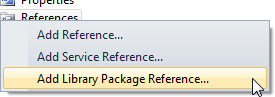
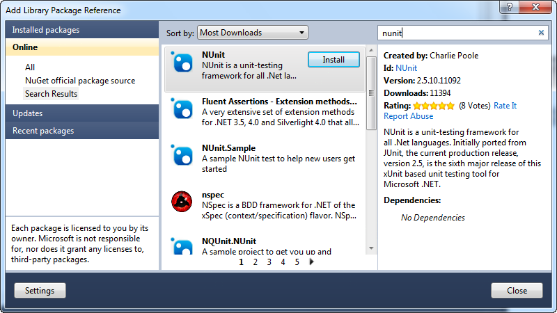
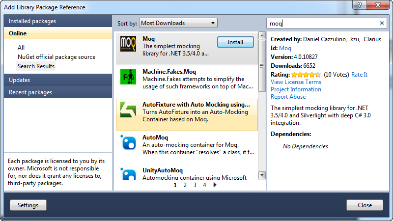
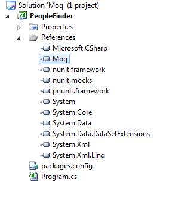
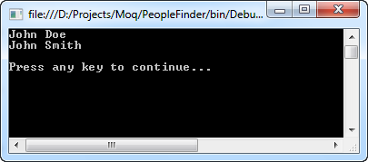
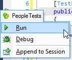
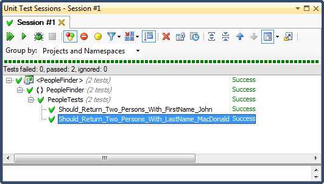
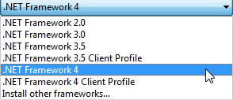
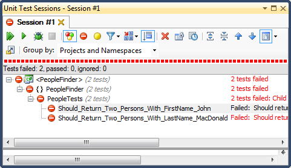

# NUnit & Moq

## Introduction

This post is a quick primer on setting up some simple unit tests using a mocking library. For this exercise I used the [NUnit](http://www.nunit.org/) unit testing framework and the [Moq](http://code.google.com/p/moq/) mocking library.

This post shows how you can mock a dependency. Using the actual dependency when performing unit tests can prove unreliable. For instance, the object on which your unit tests rely might retrieve data from a database. This data might have been changed resulting in broken tests.

Let's demonstrate how to mock such a dependency using NUnit and the Moq framework.

## Getting Started

Start up Visual Studio 2010 and create a new blank solution called "Moq". Add a new console application to it called PeopleFinder. Using [NuGet](http://nuget.org/) add references to the NUnit and Moq frameworks.

Right-click on References in the solution explorer and select "Add Library Package Reference".



**Remark**: If you are not familiar with NuGet, please [download and install](http://nuget.org/) the Visual Studio extension and read [this article](http://www.hanselman.com/blog/IntroducingNuPackPackageManagementForNETAnotherPieceOfTheWebStack.aspx) in order to acquaint yourself with it.

Search the online repository for NUnit in the official NuGet source feed and click Install to download the package. The necessary references will automatically be added to your project.



Do the same for the Moq framework.



Notice that the required references for NUnit and Moq have been added.



## Demo Application

Let's add some code to the console application so that it actually does something. As its name (PeopleFinder) suggests, this application allows users to query a repository of people. Each person is represented by an instance of the Person class.

Add a new code file called Person.cs to the project and add the following code to it.

```csharp
public abstract class DomainObject
{ }

public class Person : DomainObject
{
    public string FirstName { get; set; }
    public string LastName { get; set; }
}
```

Next we need to setup a repository which enables us to query a collection of persons. Add a code file called PeopleRepository to the project and add the following code to it.

```csharp
public interface IRepository<out T> where T : DomainObject
{
    IEnumerable<T> GetAll();
}

public class PersonRepository : IRepository<Person>
{
    private static IEnumerable<Person> _people;

    private static IEnumerable<Person> GetPeople()
    {
        if (_people != null) return _people;

        _people = new List<Person>
        {
            new Person {FirstName = "John", LastName = "Doe"},
            new Person {FirstName = "Jane", LastName = "Doe"},
            new Person {FirstName = "John", LastName = "Smith"},
            new Person {FirstName = "Matthew", LastName = "MacDonald"},
            new Person {FirstName = "Andrew", LastName = "MacDonald"}
        };

        return _people;
    }

    public IEnumerable<Person> GetAll()
    {
        return GetPeople();
    }
}
```

The IRepository interface only declares one method (GetAll) which returns a collection of DomainObject instances. The PersonRepository class implements the interface and specifies the Person class as the generic parameter. The implemented GetAll() method returns a collection of Person objects.

**Remark**: Of course in the real world you have to deal with more complex repository interfaces and repositories that actually query a datastore such as a database, XML files...etc. I kept the code for this post simple and short for illustrative purposes and to keep the focus on the main subject, namely quicky setting up unit tests using the NUnit and Moq frameworks.

The demo application is almost finished. Add a new class called People to the project and add the code shown below to it.

```csharp
public class People
{
    private readonly IRepository<Person> _repository;

    public People(IRepository<Person> repository)
    {
        this._repository = repository;
    }

    public IEnumerable<Person> Query(Func<Person, bool> predicate)
    {
        return this._repository.GetAll().Where(predicate).ToList();
    }
}
```

When creating an instance of the People class you need to specify a repository of persons (IRepository). The Query mehod allows you to query said repository using a predicate (`Func<Person, bool>`). Internally the Query method uses the GetAll() method of the repository.

Let's use the People class to find all persons called John.

```csharp
class Program
{
    static void Main()
    {
        var repository = new PersonRepository();

        var people = new People(repository);

        var persons = people.Query(p => p.FirstName == "John");

        foreach (var person in persons)
        {
            Console.WriteLine("{0} {1}", person.FirstName, person.LastName);
        }

        Console.WriteLine();
        Console.Write("Press any key to continue...");
        Console.ReadKey();
    }
}
```

If everything goes well you should see the following output:



## Unit Tests

Now that the demo application is up and running let's create some simple unit tests using the NUnit framework. We want to check that the Query method returns a correct number of Person instances.

Add a class called PeopleTests to the project and add the following code to it:

```csharp
[TestFixture]
public class PeopleTests
{
    [Test]
    public void Should_Return_Two_Persons_With_FirstName_John()
    {
        // Setup
        var repository = new PersonRepository();
        var people = new People(repository);

        // Action
        var persons = people.Query(p => p.FirstName == "John");

        // Verify the result
        Assert.AreEqual(persons.Count(), 2, "Should return 2 persons with first name John.");
    }

    [Test]
    public void Should_Return_Two_Persons_With_LastName_MacDonald()
    {
        // Setup
        var repository = new PersonRepository();
        var people = new People(repository);

        // Action
        var persons = people.Query(p => p.LastName == "MacDonald");

        // Verify the result
        Assert.AreEqual(persons.Count(), , "Should return 2 persons with last name MacDonald.");
    }
}
```

By marking the PeopleTests class with the \[TestFixture\] attribute you inform NUnit that this class contains tests. Next you need to mark which methods of this class contain tests by applying the \[Test\] attribute to them.

Here you can see that it contains two tests. The first tests checks if the Query method returns two persons with the first name "John" and the second tests checks if the Query method returns two persons with the last name "MacDonald". These simple unit tests verify that the Query method behaves correctly.

You can run the tests by left-clicking on the green/yellow icon displayed to the left of the PeopleTests class and selecting "Run".



The results are displayed in a separate window.



## Mocking Dependencies

If someone changes the data in the data store which the PersonRepository queries then the unit tests might break. Let's assume that the repository queries a database instead of a static collection of Person objects. If someone adds another person with the first name "John" or the last name "MacDonald" then the tests will not succeed. The Query method will return more Person instances than expected. The unit tests are dependant on the data stored in the data store that is queried. In other words you have dependency on the repository which the People class uses internally.

Let's use the Moq framework to mock this repository so that the unit tests keep on working. This is actually very simple. Instead of creating a PersonRepository instance, we use the Mock type provided by the Moq framework and tell it to create a mocked instance based on the IRepository interface where T is of the type Person. When passing the repository in the People's constructor you specify that the mocked object should be used.

```csharp
// Setup
var repository = new Mock<IRepository<Person>>();
var people = new People(repository.Object);
```

**Remark**: Be sure to set the target framework of the console application to the .NET framework 4 instead of the .NET framework 4 client profile. If you forget this the project will not compile if you include the Moq namespace in any of the usings sections.



If you run the unit tests now, you'll notice that they fail.



Because you mocked the repository which the People object uses internally it will no longer return any data. The mocked object's GetAll method will not perform any actions. You successfully removed the dependency on the repository.

We're almost there. Now we need to tell the the mocked repository which data it should return when it's GetAll method is invoked. We can do this by creating a collection of Person instances which is only used when executing the test. Next we call the Setup() method on the mocked object and specify that it should return this collection whenever the GetAll method is called as shown in the following code fragment.

```csharp
[Test]
public void Should_Return_Two_Persons_With_FirstName_John()
{
    // Setup
    var repository = new Mock<IRepository<Person>>();

    var data = new List<Person>
    {
        new Person {FirstName = "John", LastName = "Doe"},
        new Person {FirstName = "Jane", LastName = "Doe"},
        new Person {FirstName = "John", LastName = "Smith"},
        new Person {FirstName = "Matthew", LastName = "MacDonald"},
        new Person {FirstName = "Andrew", LastName = "MacDonald"}
    };

    repository.Setup(r => r.GetAll()).Returns(data);

    var people = new People(repository.Object);

    // Action
    var persons = people.Query(p => p.FirstName == "John");

    // Verify the result
    Assert.AreEqual(persons.Count(), 2, "Should return 2 persons with first name John.");
}
```

If you adjust both the tests and re-run them they will both succeed. You've now created unit tests with NUnit and removed any dependencies by mocking them with the Moq framework.
